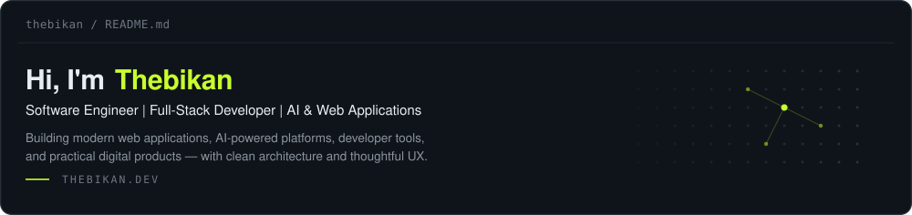

<!--
  OPTIONAL SEPARATE BANNER
  A standalone personal-brand banner already exists at assets/banner.svg.
  It is intentionally not rendered above, because two full-width visuals
  stacked back to back push Featured Projects below the fold.
  To use it, paste this line directly beneath the two buttons above:

  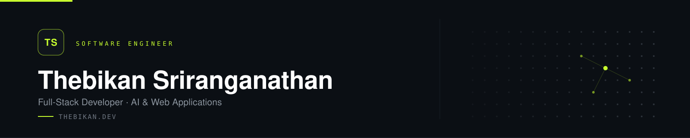
-->

<table>
<tr>

<td align="center" width="33%">
  
<b>Software Engineer</b> 
ROLE
</td>

<td align="center" width="33%">
  
<b>Full-Stack Development</b> 
DISCIPLINE
</td>

<td align="center" width="33%">
  
<b>AI &amp; Web Applications</b> 
FOCUS
</td>

</tr>
<tr>

<td align="center" width="33%">
  
<b>Product-Minded Engineering</b> 
APPROACH
</td>

<td align="center" width="33%">
  
<b>Six Featured Projects</b> 
WORK
</td>

<td align="center" width="33%">
  
<b><a href="https://thebikan.dev">thebikan.dev</a></b> 
PORTFOLIO
</td>

</tr>
</table>

## About Me

I'm a software engineer who builds useful digital products — full-stack web applications, AI-powered platforms, backend systems and developer tools. I care about taking an idea from concept to production without losing sight of the person who ends up using it.

My approach is product-minded: clean architecture, readable code and interfaces that stay simple, fast and maintainable. Good engineering and good UX are the same problem viewed from two sides.

## Tools & Technologies

<b>Convex</b> · <b>Ktor</b> · <b>Jetpack Compose</b> · <b>Windows Forms</b> · <b>SQL Server</b> · <b>REST APIs</b>

## Featured Projects

<table>
<tr>

<td width="33%"><a href="https://connectify-labs.vercel.app">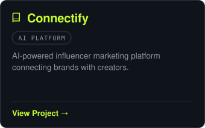</a></td>

<td width="33%"><a href="https://nova-credit-wheat.vercel.app">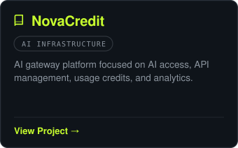</a></td>

<td width="33%">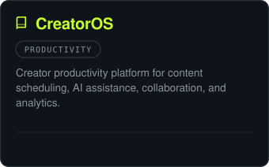</td>

</tr>
<tr>

<td width="33%">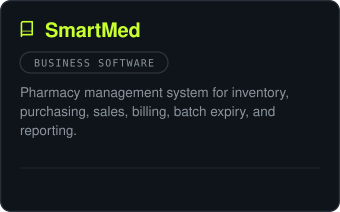</td>

<td width="33%"><a href="https://thebikan.dev">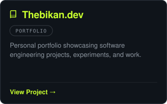</a></td>

<td width="33%">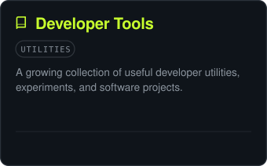</td>

</tr>
</table>

## GitHub Stats

## Current Focus

<table>
<tr>

<td align="center" width="25%">
  
<b>Web</b> 
Modern, scalable full-stack applications
</td>

<td align="center" width="25%">
  
<b>AI</b> 
AI-powered platforms and tools
</td>

<td align="center" width="25%">
  
<b>Backend</b> 
APIs, architecture and reliable systems
</td>

<td align="center" width="25%">
  
<b>UX</b> 
Simple and useful digital experiences
</td>

</tr>
</table>

## Engineering Philosophy

<table>
<tr>

<td width="33%">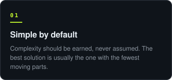</td>

<td width="33%">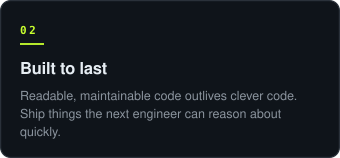</td>

<td width="33%">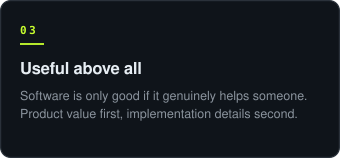</td>

</tr>
</table>
